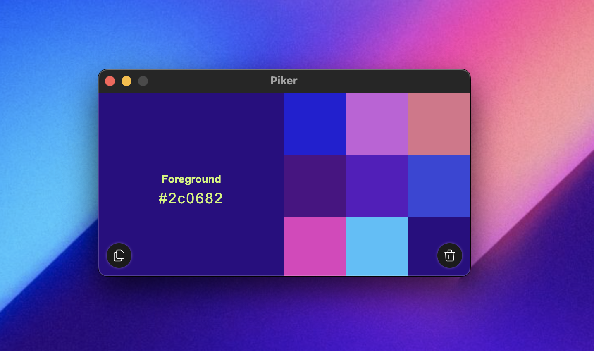

# Piker - Open-Source Color Picker

Piker is an easy-to-use, open-source, color picker app. With Piker, you can quickly and efficiently find colors on your screen in the exact hex code you need, making it ideal for designers who value speed and precision.

## Features

- Intuitive and user-friendly interface.
- Simple and efficient color picking process.
- Copy colors directly to the clipboard for easy integration into your design workflow.
- Lightweight and resource-friendly.

## Installation

To install and use Piker, follow these steps:

1. Download or clone the latest version of Piker from the [repository](https://github.com/zhtkrky/piker/).
2. Install dependencies by running `npm install` in the project directory.
3. Build the app by running `npm run build`.
4. This command will create a `dist` folder containing the built app.
5. Run the app by double-clicking the `Piker` file in the `dist` folder.

## Usage

Using Piker is straightforward:

1. Click on the Piker icon in the menu bar to open the app.
2. A color picker loupe will appear, allowing you to hover over any area on your screen to capture the color.
3. The selected color will be displayed in the app window.
4. Copy the color value to the clipboard by clicking the corresponding button.
5. Use the copied color in your favorite design or development tools.

## Contributing

Contributions to Piker are welcome! If you'd like to contribute, please follow these steps:

1. Fork the repository and clone it to your local machine.
2. Create a new branch for your feature or bug fix.
3. Make your modifications and ensure that the app is functioning correctly.
4. Commit your changes and push them to your forked repository.
5. Submit a pull request, detailing the changes you've made.

## License

Piker is released under the [MIT License](LICENSE.md).

## Acknowledgments

Piker was built with love and with the help of the following open-source libraries:

- [Electron](https://www.electronjs.org/)
- [Vue](https://vuejs.org/)
- [Pinia](https://pinia.vuejs.org/)

Special thanks to the developers and contributors of these libraries.

## Contact

If you have any questions, suggestions, or feedback, feel free to reach out to us:

- Contact: [zhtkrky.me](https://zhtkrky.me/)

We appreciate your interest in Piker and welcome any form of contribution or feedback.

Happy color picking! 💅
